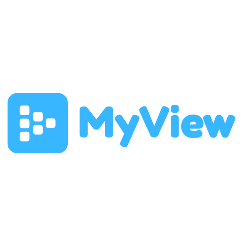
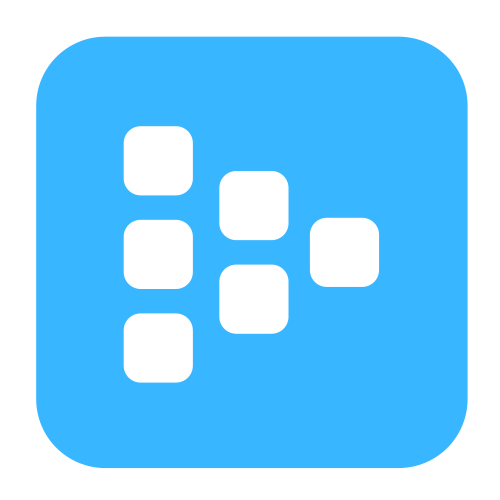

<div id="top"></div>

<!-- PROJECT LOGO -->
<br />
<div align="center">
  <a href="https://github.com/prithvijitguha/MyView">
    
  </a>

  <p align="center">
    <strong>MyView</strong> is an online video sharing platform built using FastAPI
    <br />
    <a href="https://myview.readthedocs.io/en/latest/"><strong>Explore the docs »</strong></a>
    <br />
    <br />
    <a href="https://github.com/prithvijitguha/MyView/issues/new/choose">Report Bug</a>
    ·
    <a href="https://github.com/prithvijitguha/MyView/issues/new/choose">Request Feature</a>
  </p>
</div>


&nbsp;
[](https://dev.azure.com/prithvijitguha20703/Home%20projects/_build/latest?definitionId=3&branchName=master)&nbsp;
[](https://www.python.org/downloads/release/python-390/)&nbsp;
[](https://myview.readthedocs.io/en/latest/?badge=latest)


<!-- TABLE OF CONTENTS -->

<summary>Table of Contents</summary>
<ol>
  <li>
    <a href="#about-the-project">About The Project</a>
    <ul>
      <li><a href="#built-with">Built With</a></li>
    </ul>
  </li>
  <li>
    <a href="#getting-started">Getting Started</a>
    <ul>
      <li><a href="#prerequisites">Prerequisites</a></li>
      <li><a href="#installation">Installation</a></li>
    </ul>
  </li>
  <li><a href="#usage">Usage</a></li>
  <li><a href="#roadmap">Roadmap</a></li>
  <li><a href="#contributing">Contributing</a></li>
  <li><a href="#acknowledgments">Acknowledgments</a></li>
</ol>


<!-- ABOUT THE PROJECT -->
## About The Project

**STATUS: Development**


<a href="https://github.com/prithvijitguha/MyView">
    
</a>


MyView is an online video sharing platform currently in development using FastAPI at its core. A full list of our tech stack is available at our documenations. Here's a [link](https://myview.readthedocs.io/en/latest/architecture.html)


<p align="right">(<a href="#top">back to top</a>)</p>


### Built With

* [FastApi](https://fastapi.tiangolo.com/)
* [Python](https://www.python.org/)
* [PostgreSQL](https://www.postgresql.org/)
* [Heroku](https://www.heroku.com/)
* [AzurePipelines](https://azure.microsoft.com/en-in/services/devops/pipelines/)
* [GithubActions](https://github.com/features/actions)
* [Amazon S3](https://aws.amazon.com/s3/)
* [Javascript](https://developer.mozilla.org/en-US/docs/Web/JavaScript)
* [Bootstrap](https://getbootstrap.com/)
* [JQuery](https://jquery.com)
* [ReadTheDocs](https://readthedocs.org/)

<p align="right">(<a href="#top">back to top</a>)</p>


<!-- GETTING STARTED -->
## Getting Started

To get started on this project. To get a local copy up and running follow these simple example steps.

### Prerequisites

1. Creat a virtual environment
    ```sh
    python -m venv myview
    ```
2. Activate virtual environment

    Linux:
    ```sh
    source myview/bin/activate
    ```

    Windows:
    ```sh
    myview/scripts/activate
    ```


### Installation

1. Clone the repo
   ```sh
   git clone https://github.com/prithvijitguha/MyView.git
   cd MyView
   ```
2. Install requirements
   ```sh
   pip install -r requirements.txt
   ```
3. Run the project locally
   ```python
   uvicorn main:app --reload
   ```

<p align="right">(<a href="#top">back to top</a>)</p>


<!-- ROADMAP -->
## Roadmap

- [x] Basic Backend
- [x] Basic Front End
- [x] Azure Pipelines
- [x] Github Actions
- [ ] Development
    - [x] Login
    - [x] Upload Video
    - [x] Connect File Storage
    - [x] Setup Development Database
    - [x] Setup Project Templates
    - [ ] Playing Video Function
    - [ ] Homepage
    - [ ] Comment Section
- [ ] Production
    - [ ] Setup Production Database
    - [ ] Production Server
    - [ ] Production pipeline
See the [open issues](https://github.com/prithvijitguha/MyView/issues/) for a full list of proposed features (and known issues).

<p align="right">(<a href="#top">back to top</a>)</p>


<!-- CONTRIBUTING -->
## Contributing

Contributions are what make the open source community such an amazing place to learn, inspire, and create. Any contributions you make are **greatly appreciated**.

If you have a suggestion that would make this better, please fork the repo and create a pull request. You can also simply open an issue with the tag "enhancement".
Don't forget to give the project a star! Thanks again!

Full contributing guide for [documentation](https://myview.readthedocs.io/en/latest/contributing_guide_docs.html)

Full contributing guide for [codebase](https://myview.readthedocs.io/en/latest/contributing_guide_code.html)

<p align="right">(<a href="#top">back to top</a>)</p>


<!-- ACKNOWLEDGMENTS -->
## Acknowledgments

* [FastApiTutorial](https://fastapi.tiangolo.com/tutorial/)
* [emojipedia](https://emojipedia.org/)
* [canva](https://www.canva.com/)
* [bestreadmetemplate](https://github.com/othneildrew/Best-README-Template)
* [fastAPIexampleproject](https://github.com/Vibhav0/Auth)
* [ultimate-fastapi-tutorial](https://github.com/ChristopherGS/ultimate-fastapi-tutorial)


<p align="right">(<a href="#top">back to top</a>)</p>

