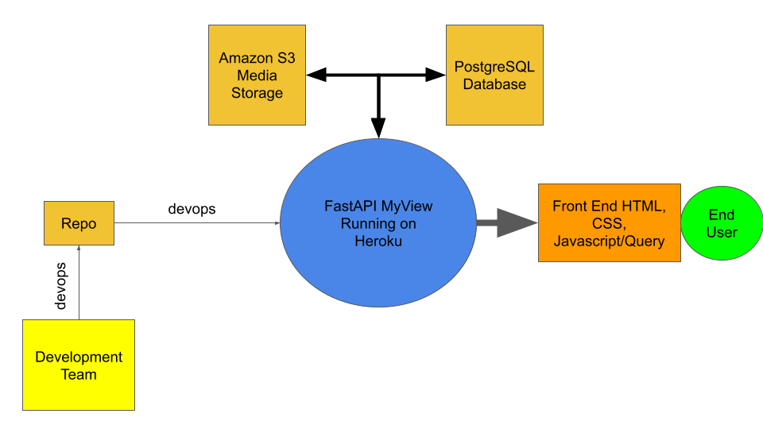

Architecture
=====================

#. Backend: FastAPI
#. Front End: Javascript, JQuery, HTML, CSS
#. Database: PostgreSQL
#. CI/CD: github-actions and azure pipelines, precommit hooks
#. Server: Heroku(Ubuntu OS)
#. Static Files Storage: AWS S3
#. Devops: Azure Devops
#. Repo: github

MyView Architecture
--------------------
